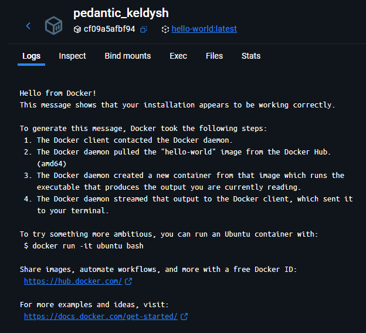
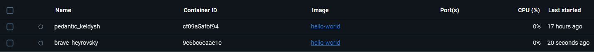

 # Comandos de Docker

> Permite jalar una imagen en especifico
##   docker pull hello-world

>  >1. Consola devolvio:
    docker pull hello-world
    Using default tag: latest
    latest: Pulling from library/hello-world
    17eec7bbc9d7: Pull complete
    Digest: sha256:54e66cc1dd1fcb1c3c58bd8017914dbed8701e2d8c74d9262e26bd9cc1642d31
    Status: Downloaded newer image for hello-world:latest
    docker.io/library/hello-world:latest
##

> Para correr una imagen
##   docker container run hello-world

>  >2. La consola me devovlio:

    Hello from Docker!
    This message shows that your installation appears to be working correctly.

    To generate this message, Docker took the following steps:
    1. The Docker client contacted the Docker daemon.
    2. The Docker daemon pulled the "hello-world" image from the Docker Hub.
        (amd64)
    3. The Docker daemon created a new container from that image which runs the
        executable that produces the output you are currently reading.
    4. The Docker daemon streamed that output to the Docker client, which sent it
        to your terminal.

    To try something more ambitious, you can run an Ubuntu container with:
    $ docker run -it ubuntu bash

    Share images, automate workflows, and more with a free Docker ID:
    https://hub.docker.com/

    For more examples and ideas, visit:
    https://docs.docker.com/get-started/

> Al ejecutarsre por 2da vez, no indica que esta completamente actualizado

##   docker pull hello-world

> > 3. La consola me devovlio:
    Using default tag: latest
    latest: Pulling from library/hello-world
    Digest: sha256:54e66cc1dd1fcb1c3c58bd8017914dbed8701e2d8c74d9262e26bd9cc1642d31
    Status: Image is up to date for hello-world:latest
    docker.io/library/hello-world:latest

