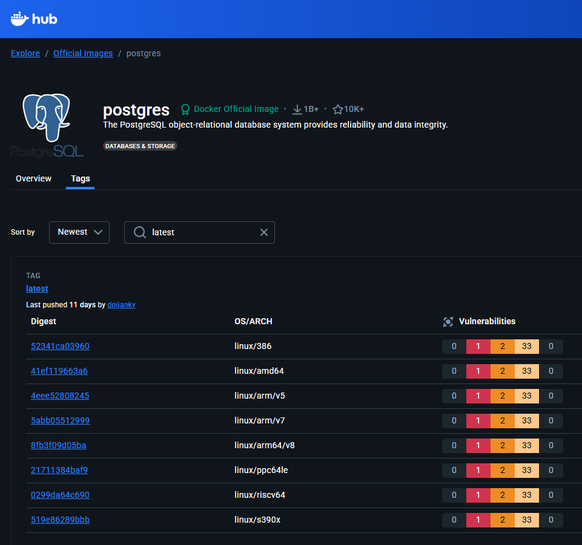

# Comandos de Docker 3 / Variables de Entorno

## Se busca la imagen de postgres oficial:

## Se instala la imagen de postgres:

> docker pull postgres:latest

> > la consola devolvio:
> > docker pull postgres:latest
1d83e33d11e9: Pull complete
98a86eab6353: Pull complete
cfcb89870710: Pull complete
e5baa5776b92: Pull complete
b6038fb9c5fa: Pull complete
a80dd9fac9bc: Pull complete
27009aeaf88d: Pull complete
4043a0df36b4: Pull complete
73dfcde3cab4: Pull complete
b669c29718de: Pull complete
b1b94b4bf231: Pull complete
4fcee84ce502: Pull complete
88af8c060117: Pull complete
ce1261c6d567: Pull complete
Digest: sha256:feff5b24fedd610975a1f5e743c51a4b360437f4dc3a11acf740dcd708f413f6
Status: Downloaded newer image for postgres:latest
docker.io/library/postgres:latest

## start a postgres instance

> > docker run --name root -e POSTGRES_PASSWORD=psw -d postgres

> > consola devuelve:
1c52c2421078d5a9e0c7205801703541c0ffee0b69328726e98bebd32bd6491d

## Como utilizar variables de entorno:

$ docker run -d \
	--name some-postgres \
	-e POSTGRES_PASSWORD=mysecretpassword \
	-e PGDATA=/var/lib/postgresql/data/pgdata \
	-v /custom/mount:/var/lib/postgresql/data \
	postgres

