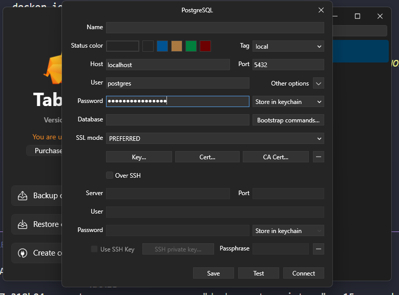
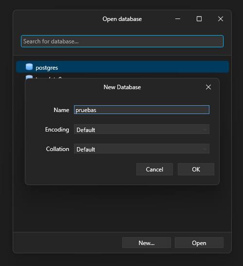

# Comandos de Docker 3 / Variables de Entorno 2

## Se modifica la instancia dew postgres:

> docker run --name some-postgres -dp 5432:5432 -e POSTGRES_PASSWORD=mysecretpassword postgres

>> La consola devuelve:
b1eb7e318b04   postgres                 "docker-entrypoint.s…"   15 seconds ago   Up 14 seconds   0.0.0.0:5432->5432/tcp, [::]:5432->5432/tcp   some-postgres

## Se crea una conexión con TablePLus:

## Crear una base de datos de pruebas:

