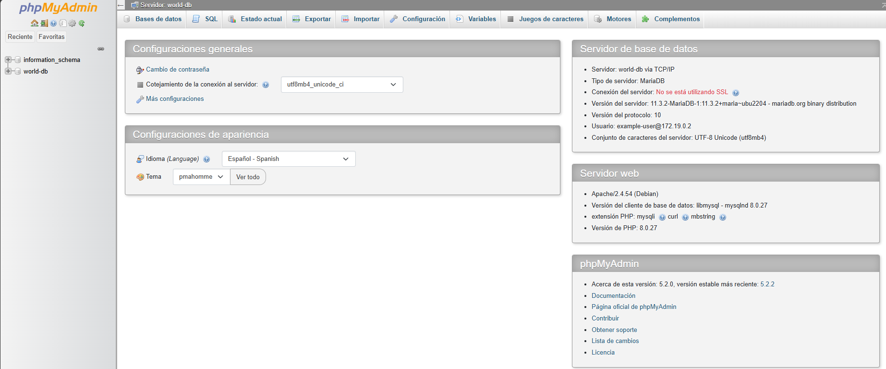

# Redes de contenedores

## Visualizar las redes de docker
> docker network ls

## Crear una Network:
> docker network create world-app

5192c51e4f44   world-app                   bridge    local

## conectar contenedores:

> docker network connect world-app 3f0 
>>Contenedor de Phpmyadmin
> docker network connect world-app ee3
>> Contenedor de Maria-DB

## Verificar conecxion a la misma red

> docker network inspect world-app

>> consola devolvio:

[
    {
        "Name": "world-app",
        "Id": "5192c51e4f4433baa54ca5e55d1b216de267b86da8adbf801ef351e19f5a11df",
        "Created": "2025-09-23T03:54:36.585485534Z",
        "Scope": "local",
        "Driver": "bridge",
        "EnableIPv4": true,
        "EnableIPv6": false,
        "IPAM": {
            "Driver": "default",
            "Options": {},
            "Config": [
                {
                    "Subnet": "172.19.0.0/16",
                    "Gateway": "172.19.0.1"
                }
            ]
        },
        "Internal": false,
        "Attachable": false,
        "Ingress": false,
        "ConfigFrom": {
            "Network": ""
        },
        "ConfigOnly": false,
        "Containers": {
            "3f0d05256bb5d5d5dcd7d68024f4aaac6defcfe48b617a8c50cd72886298f1ef": {
                "Name": "phpmyadmin",
                "EndpointID": "f5ebc24fbdcd2c13dac41bf795d1591fa99a23bfcce5ba1d41d3966348abd302",
                "MacAddress": "0e:51:21:39:07:82",
                "IPv4Address": "172.19.0.2/16",
                "IPv6Address": ""
            },
            "ee34687ec1be0558ed5cb3fa6f96f232a7c1dd34e10c6e8791d9bf5c5f5a85d9": {
                "Name": "world-db",
                "EndpointID": "c791c2984aa364ee83ca34ef78f55f50e5c91a15eee8a1f03fe8bf847c878f26",
                "MacAddress": "da:2e:22:8a:30:37",
                "IPv4Address": "172.19.0.3/16",
                "IPv6Address": ""
            }
        },
        "Options": {
            "com.docker.network.enable_ipv4": "true",
            "com.docker.network.enable_ipv6": "false"
        },
        "Labels": {}
    }
]

## Network con ambos contenedores en ejecucion:

