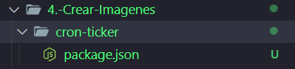
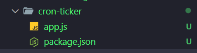
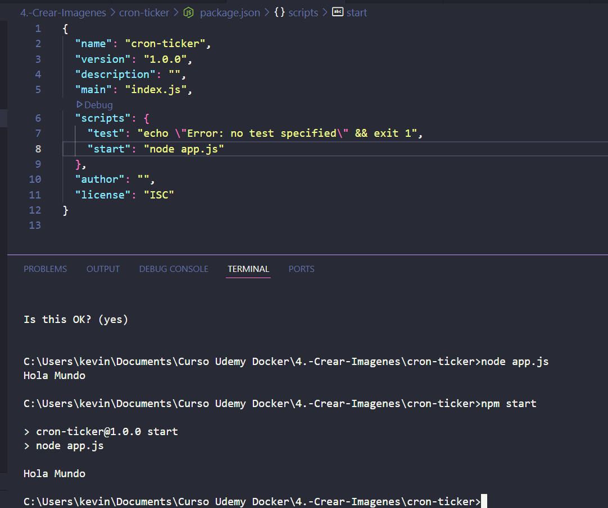

# Dockerfiles

>Permite empaquetar en una imagen un proyector
>> Se le conoce como dockerizar un proyecto
>> Se debe optimizar la imagen de docker para pasar de 500MB a 100MB

> npm i node-cron

>>Hay que crear una aplicacion:

>> node -v
    v22.19.0

>> npm init:

This utility will walk you through creating a package.json file.
It only covers the most common items, and tries to guess sensible defaults.

See `npm help init` for definitive documentation on these fields
and exactly what they do.

Use `npm install <pkg>` afterwards to install a package and
save it as a dependency in the package.json file.

Press ^C at any time to quit.
package name: (cron-ticker)
version: (1.0.0)                                                                                            
description:                                                                                                
entry point: (index.js)                                                                                     
test command:                                                                                               
git repository:                                                                                             
keywords:                                                                                                   
author:                                                                                                     
license: (ISC)                                                                                              
About to write to C:\Users\kevin\Documents\Curso Udemy Docker\4.-Crear-Imagenes\cron-ticker\package.json:

{
  "name": "cron-ticker",
  "version": "1.0.0",
  "description": "",
  "main": "index.js",
  "scripts": {
    "test": "echo \"Error: no test specified\" && exit 1"
  },
  "author": "",
  "license": "ISC"
}

Is this OK? (yes)

> Hasta crear el package.json:

> Crear tambien un app.js con un console.log:

# Ejecutar cambios:

> node app.js

>> Hola Mundo

# instala node-crone:

> npm i node-cron

added 1 package, and audited 2 packages in 1s

found 0 vulnerabilities