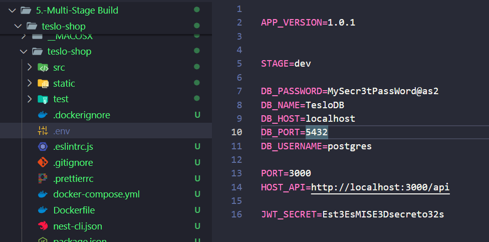
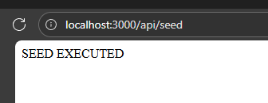
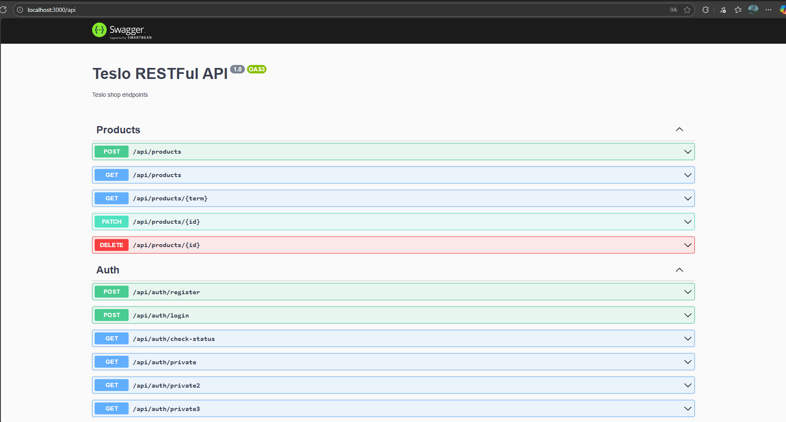

# Teslo-shop

>npm install --global yarn

>yarn --version       
1.22.22

>> .env

>> docker-compose up -d

time="2025-09-25T11:06:03-06:00" level=warning msg="C:\\Users\\kevin\\Documents\\Curso Udemy Docker\\5.-Multi-Stage Build\\teslo-shop\\teslo-shop\\docker-compose.yml: the attribute `version` is obsolete, it will be ignored, please remove it to avoid potential confusion"
[+] Running 14/14
 ✔ db Pulled                                                                                          16.3s 
[+] Running 3/3
 ✔ Network teslo-shop_default       Created                                                            0.1s 
 ✔ Volume "teslo-shop_postgres-db"  Created                                                            0.0s 
 ✔ Container TesloDB                Started  

 
 