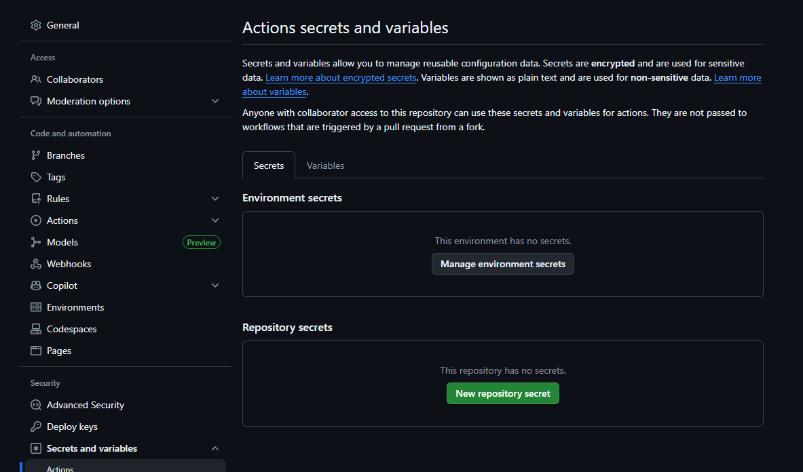
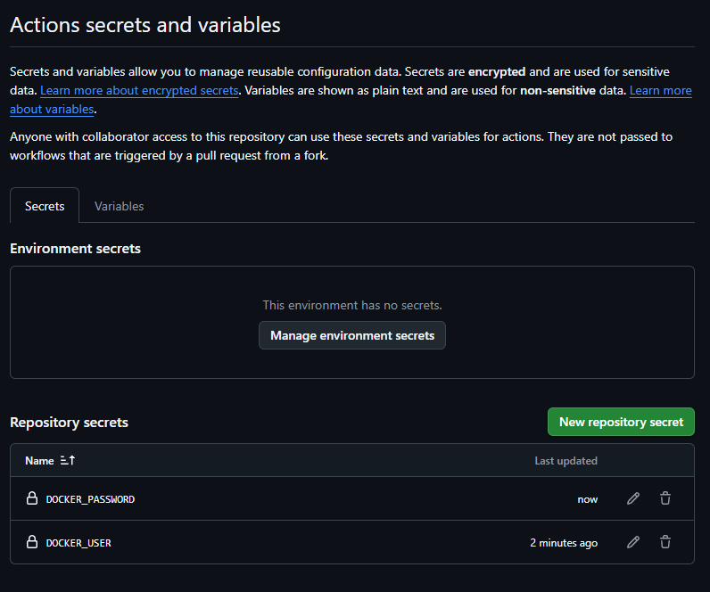
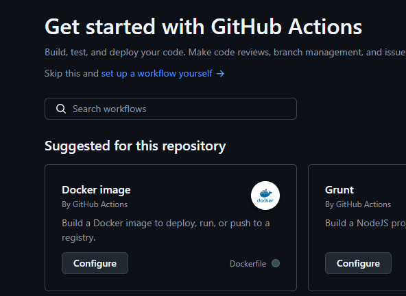
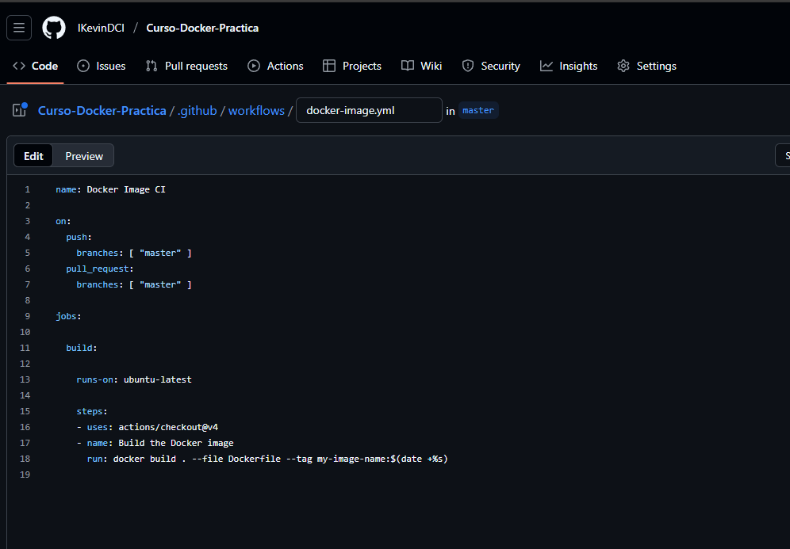

# Github Actions

> Se crea un nuevo repositorio (voy a ver si lo puedo hacer desde el que tengo actualmente creado)

>> Tiene que ser un repositorio publico 

> Se crean llaves privadas:

> Se crean variables de entorno secretas:

>> Utilizamos Github Actions:

> 

