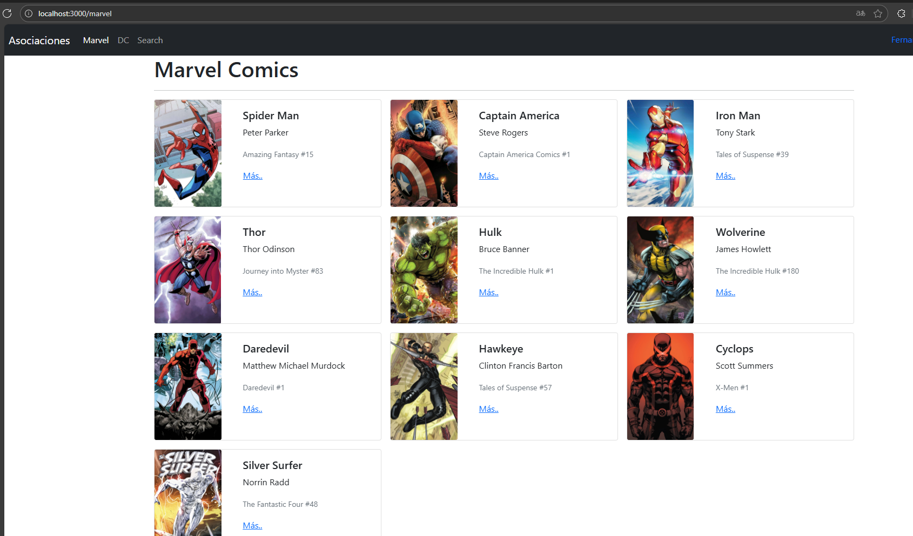

# Creacion del proyecto:

# Busacamos la imagen oficial de Nginx

> $ docker run --name some-nginx -d -p 8080:80 nginx:1.23.3

Unable to find image 'nginx:1.23.3' locally
1.23.3: Pulling from library/nginx
d4ceccbfc269: Pull complete
84181e80d10e: Pull complete
f1f26f570256: Pull complete
1ff0f94a8007: Pull complete
e9427fcfa864: Pull complete
d776269cad10: Pull complete
Digest: sha256:f4e3b6489888647ce1834b601c6c06b9f8c03dee6e097e13ed3e28c01ea3ac8c
Status: Downloaded newer image for nginx:1.23.3
5f3d436a3b03e5caaa036031dad775b71c25e74efd94831837e21ca62b23d5a1

docker exec -t 5f3 bash

# Contruir la iamgen de la aplicacion:

> docker build -t heroes-app . --no-cache

> docker container run -p 80:80 heroes-app

