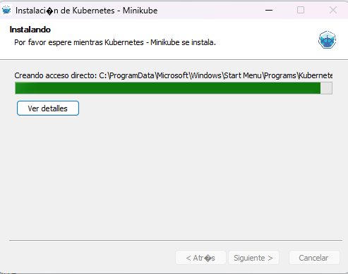

# Kubernets

> Permite mantener una imagen 24/7 disponible 

>> Actua como el director de opera en una orquesta

>> Desacargar MiniKube

minikube version: v1.37.0
commit: 65318f4cfff9c12cc87ec9eb8f4cdd57b25047f3

> minikube start:
C:\Users\kevin\Documents\Curso Udemy Docker\9.-Kubernets>minikube start
😄  minikube v1.37.0 on Microsoft Windows 11 Home Single Language 10.0.26100.6584 Build 26100.6584
✨  Automatically selected the docker driver. Other choices: virtualbox, ssh
📌  Using Docker Desktop driver with root privileges
👍  Starting "minikube" primary control-plane node in "minikube" cluster
🚜  Pulling base image v0.0.48 ...
💾  Downloading Kubernetes v1.34.0 preload ...
    > gcr.io/k8s-minikube/kicbase...:  488.52 MiB / 488.52 MiB  100.00% 10.76 M
    > preloaded-images-k8s-v18-v1...:  337.07 MiB / 337.07 MiB  100.00% 4.33 Mi
🔥  Creating docker container (CPUs=2, Memory=3900MB) ... 
❗  Failing to connect to https://registry.k8s.io/ from inside the minikube container
💡  To pull new external images, you may need to configure a proxy: https://minikube.sigs.k8s.io/docs/reference/networking/proxy/
🐳  Preparing Kubernetes v1.34.0 on Docker 28.4.0 ... 
🔗  Configuring bridge CNI (Container Networking Interface) ...
🔎  Verifying Kubernetes components...
    ▪ Using image gcr.io/k8s-minikube/storage-provisioner:v5
🌟  Enabled addons: storage-provisioner, default-storageclass

❗  C:\Program Files\Docker\Docker\resources\bin\kubectl.exe is version 1.32.2, which may have incompatibilities with Kubernetes 1.34.0.
    ▪ Want kubectl v1.34.0? Try 'minikube kubectl -- get pods -A'
🏄  Done! kubectl is now configured to use "minikube" cluster and "default" namespace by default

