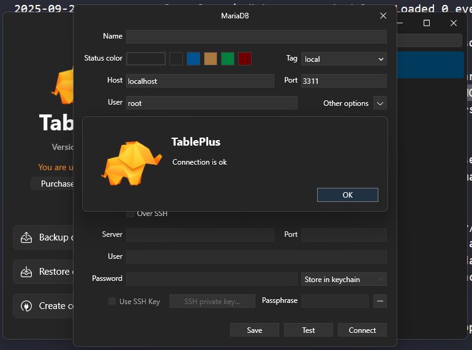

# Logs del contenedor

## Comando para instalar la imagen de amria db:
> docker pull mariadb:latest

## Se configuran las variables de entorno:

> docker container run -e MARIADB_RANDOM_ROOT_PASSWORD=yes -dp 3306:3306 mariadb:jammy

>> consola devovlio:
C:\Users\kevin\Documents\Curso Udemy Docker>docker container run -e MARIADB_RANDOM_ROOT_PASWWORD=yes -dp 3311:3306 mariadb:jammy
3f0f3184608359279879fafe1343be6ef77247441d2effeb01d27c62193ca63e

## comandos logs:

> docker container logs 3f0f3184608359279879fafe1343be6ef77247441d2effeb01d27c62193ca63e

>> consola me devolvio:

2025-09-22 01:25:52+00:00 [Note] [Entrypoint]: Entrypoint script for MariaDB Server 1:11.3.2+maria~ubu2204 started.
2025-09-22 01:25:52+00:00 [Warn] [Entrypoint]: /sys/fs/cgroup///memory.pressure not writable, functionality unavailable to MariaDB
2025-09-22 01:25:52+00:00 [Note] [Entrypoint]: Switching to dedicated user 'mysql'
2025-09-22 01:25:52+00:00 [Note] [Entrypoint]: Entrypoint script for MariaDB Server 1:11.3.2+maria~ubu2204 started.
2025-09-22 01:25:52+00:00 [Note] [Entrypoint]: Initializing database files
2025-09-22  1:25:53 0 [Warning] mariadbd: io_uring_queue_init() failed with errno 1
2025-09-22  1:25:53 0 [Warning] InnoDB: liburing disabled: falling back to innodb_use_native_aio=OFF

PLEASE REMEMBER TO SET A PASSWORD FOR THE MariaDB root USER !
To do so, start the server, then issue the following command:

'/usr/bin/mariadb-secure-installation'

which will also give you the option of removing the test
databases and anonymous user created by default.  This is
strongly recommended for production servers.

See the MariaDB Knowledgebase at https://mariadb.com/kb

Please report any problems at https://mariadb.org/jira

The latest information about MariaDB is available at https://mariadb.org/.

Consider joining MariaDB's strong and vibrant community:
https://mariadb.org/get-involved/

2025-09-22 01:25:54+00:00 [Note] [Entrypoint]: Database files initialized
2025-09-22 01:25:54+00:00 [Note] [Entrypoint]: Starting temporary server
2025-09-22 01:25:54+00:00 [Note] [Entrypoint]: Waiting for server startup
2025-09-22  1:25:54 0 [Note] Starting MariaDB 11.3.2-MariaDB-1:11.3.2+maria~ubu2204 source revision 068a6819eb63bcb01fdfa037c9bf3bf63c33ee42 as process 111
2025-09-22  1:25:54 0 [Note] InnoDB: Compressed tables use zlib 1.2.11
2025-09-22  1:25:54 0 [Note] InnoDB: Number of transaction pools: 1
2025-09-22  1:25:54 0 [Note] InnoDB: Using crc32 + pclmulqdq instructions
2025-09-22  1:25:54 0 [Note] mariadbd: O_TMPFILE is not supported on /tmp (disabling future attempts)
2025-09-22  1:25:54 0 [Warning] mariadbd: io_uring_queue_init() failed with errno 1
2025-09-22  1:25:54 0 [Warning] InnoDB: liburing disabled: falling back to innodb_use_native_aio=OFF
2025-09-22  1:25:54 0 [Note] InnoDB: Initializing buffer pool, total size = 128.000MiB, chunk size = 2.000MiB
2025-09-22  1:25:54 0 [Note] InnoDB: Completed initialization of buffer pool
2025-09-22  1:25:54 0 [Note] InnoDB: File system buffers for log disabled (block size=4096 bytes)
2025-09-22  1:25:54 0 [Note] InnoDB: End of log at LSN=47779
2025-09-22  1:25:54 0 [Note] InnoDB: Opened 3 undo tablespaces
2025-09-22  1:25:54 0 [Note] InnoDB: 128 rollback segments in 3 undo tablespaces are active.
2025-09-22  1:25:54 0 [Note] InnoDB: Setting file './ibtmp1' size to 12.000MiB. Physically writing the file full; Please wait ...
2025-09-22  1:25:54 0 [Note] InnoDB: File './ibtmp1' size is now 12.000MiB.
2025-09-22  1:25:54 0 [Note] InnoDB: log sequence number 47779; transaction id 14
2025-09-22  1:25:54 0 [Note] Plugin 'FEEDBACK' is disabled.
2025-09-22  1:25:54 0 [Note] Plugin 'wsrep-provider' is disabled.
2025-09-22  1:25:54 0 [Warning] 'user' entry 'root@3f0f31846083' ignored in --skip-name-resolve mode.
2025-09-22  1:25:54 0 [Warning] 'proxies_priv' entry '@% root@3f0f31846083' ignored in --skip-name-resolve mode.
2025-09-22  1:25:54 0 [Note] mariadbd: Event Scheduler: Loaded 0 events
2025-09-22  1:25:54 0 [Note] mariadbd: ready for connections.
Version: '11.3.2-MariaDB-1:11.3.2+maria~ubu2204'  socket: '/run/mysqld/mysqld.sock'  port: 0  mariadb.org binary distribution
2025-09-22 01:25:55+00:00 [Note] [Entrypoint]: Temporary server started.
2025-09-22 01:25:57+00:00 [Note] [Entrypoint]: GENERATED ROOT PASSWORD: Cx9?}ZHi@{d`B$`f<zR9_hcnj[Y`%V|,
2025-09-22 01:25:57+00:00 [Note] [Entrypoint]: Securing system users (equivalent to running mysql_secure_installation)      

2025-09-22 01:25:57+00:00 [Note] [Entrypoint]: Stopping temporary server
2025-09-22  1:25:57 0 [Note] mariadbd (initiated by: unknown): Normal shutdown
2025-09-22  1:25:57 0 [Note] InnoDB: FTS optimize thread exiting.
2025-09-22  1:25:57 0 [Note] InnoDB: Starting shutdown...
2025-09-22  1:25:57 0 [Note] InnoDB: Dumping buffer pool(s) to /var/lib/mysql/ib_buffer_pool
2025-09-22  1:25:57 0 [Note] InnoDB: Buffer pool(s) dump completed at 250922  1:25:57
2025-09-22  1:25:57 0 [Note] InnoDB: Removed temporary tablespace data file: "./ibtmp1"
2025-09-22  1:25:57 0 [Note] InnoDB: Shutdown completed; log sequence number 47779; transaction id 15
2025-09-22  1:25:57 0 [Note] mariadbd: Shutdown complete

2025-09-22 01:25:57+00:00 [Note] [Entrypoint]: Temporary server stopped

2025-09-22 01:25:57+00:00 [Note] [Entrypoint]: MariaDB init process done. Ready for start up.

2025-09-22  1:25:57 0 [Note] Starting MariaDB 11.3.2-MariaDB-1:11.3.2+maria~ubu2204 source revision 068a6819eb63bcb01fdfa037c9bf3bf63c33ee42 as process 1
2025-09-22  1:25:57 0 [Note] InnoDB: Compressed tables use zlib 1.2.11
2025-09-22  1:25:57 0 [Note] InnoDB: Number of transaction pools: 1
2025-09-22  1:25:57 0 [Note] InnoDB: Using crc32 + pclmulqdq instructions
2025-09-22  1:25:57 0 [Note] mariadbd: O_TMPFILE is not supported on /tmp (disabling future attempts)
2025-09-22  1:25:57 0 [Warning] mariadbd: io_uring_queue_init() failed with errno 1
2025-09-22  1:25:57 0 [Warning] InnoDB: liburing disabled: falling back to innodb_use_native_aio=OFF
2025-09-22  1:25:57 0 [Note] InnoDB: Initializing buffer pool, total size = 128.000MiB, chunk size = 2.000MiB
2025-09-22  1:25:57 0 [Note] InnoDB: Completed initialization of buffer pool
2025-09-22  1:25:57 0 [Note] InnoDB: File system buffers for log disabled (block size=4096 bytes)
2025-09-22  1:25:57 0 [Note] InnoDB: End of log at LSN=47779
2025-09-22  1:25:57 0 [Note] InnoDB: Opened 3 undo tablespaces
2025-09-22  1:25:57 0 [Note] InnoDB: 128 rollback segments in 3 undo tablespaces are active.
2025-09-22  1:25:57 0 [Note] InnoDB: Setting file './ibtmp1' size to 12.000MiB. Physically writing the file full; Please wait ...
2025-09-22  1:25:57 0 [Note] InnoDB: File './ibtmp1' size is now 12.000MiB.
2025-09-22  1:25:57 0 [Note] InnoDB: log sequence number 47779; transaction id 14
2025-09-22  1:25:57 0 [Note] InnoDB: Loading buffer pool(s) from /var/lib/mysql/ib_buffer_pool
2025-09-22  1:25:57 0 [Note] Plugin 'FEEDBACK' is disabled.
2025-09-22  1:25:57 0 [Note] Plugin 'wsrep-provider' is disabled.
2025-09-22  1:25:57 0 [Note] InnoDB: Buffer pool(s) load completed at 250922  1:25:57
2025-09-22  1:25:57 0 [Note] Server socket created on IP: '0.0.0.0'.
2025-09-22  1:25:57 0 [Note] Server socket created on IP: '::'.
2025-09-22  1:25:57 0 [Note] mariadbd: Event Scheduler: Loaded 0 events
2025-09-22  1:25:57 0 [Note] mariadbd: ready for connections.
Version: '11.3.2-MariaDB-1:11.3.2+maria~ubu2204'  socket: '/run/mysqld/mysqld.sock'  port: 3306  mariadb.org binary distribution

## Contraseña generada:
> Cx9?}ZHi@{d`B$`f<zR9_hcnj[Y`%V|

## comprobacion con la conexion:

