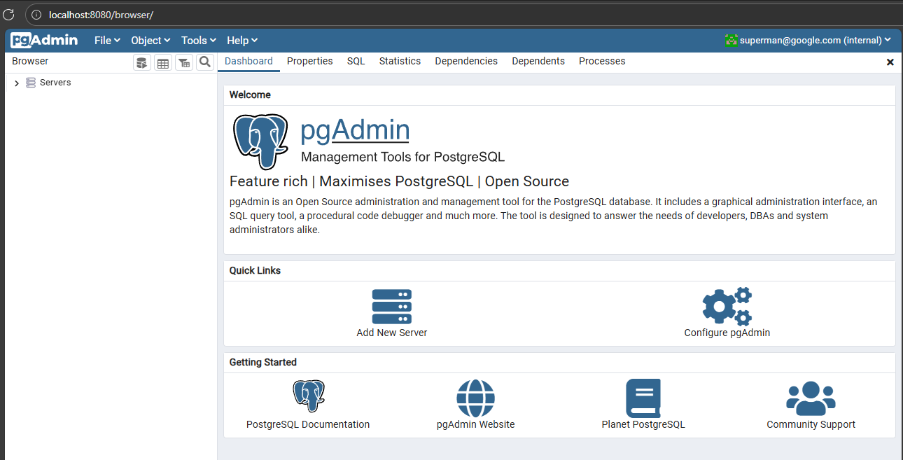
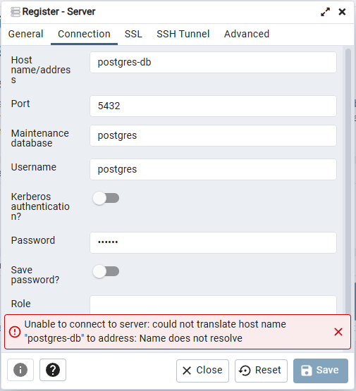
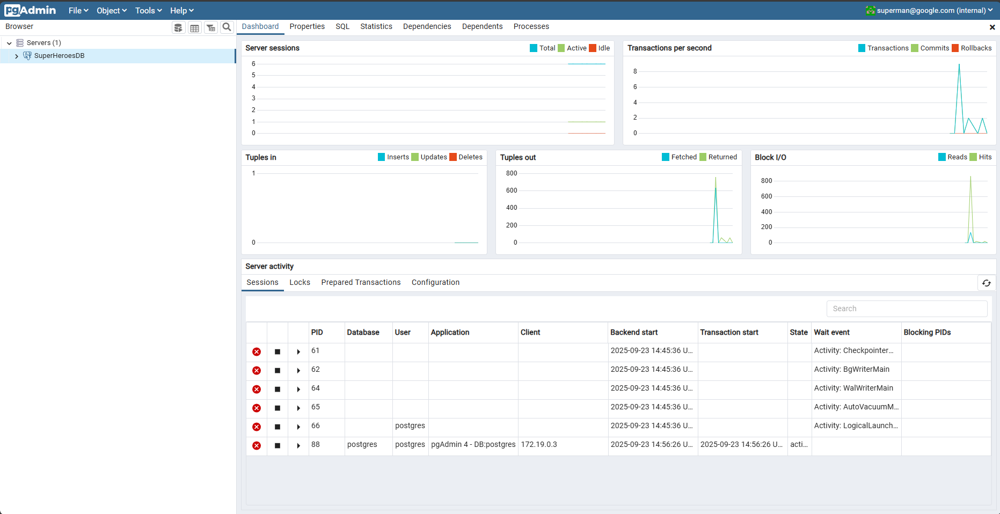

# Dokcer Hub Images

> docker volume create postgres-db

> docker container run -d --name postgres-db -e POSTGRES_PASSWORD=123456 -v postgres-db:/var/lib/postgresql/data postgres:15.1

>> consola devolvio:
Unable to find image 'postgres:15.1' locally
15.1: Pulling from library/postgres
f30287ef02b9: Pulling fs layer
7f0a68628bce: Pulling fs layer                                                                                              
48111fe612c1: Pulling fs layer                                                                                              
dc1f0e9024d8: Pulling fs layer                                                                                              
32b11818cae3: Pulling fs layer                                                                                              
f30287ef02b9: Pull complete
7f0a68628bce: Pull complete
48111fe612c1: Pull complete
dc1f0e9024d8: Pull complete
32b11818cae3: Pull complete
87f7b375a7d2: Download complete
07b5cb2894c7: Pull complete
536a8b356450: Pull complete
d9daaa1dc184: Pull complete
7cca76b73db0: Pull complete
87f7b375a7d2: Pull complete

Digest: sha256:02547253a07e6edd0c070caba1d2a019b7dc7df98b948dc9a909e1808eb77024
Status: Downloaded newer image for postgres:15.1
af1a319de863a58e4ce370efc38a9dd82e969165a3ce8aa95020eca14a59a343

> docker container run -d --name pgAdmin -e PGADMIN_DEFAULT_EMAIL=superman@google.com -e PGADMIN_DEFAULT_PASSWORD=123456 -p 8080:80 dpage/pgadmin4:6.17

>> Consola devolcio:

Unable to find image 'dpage/pgadmin4:6.17' locally
6.17: Pulling from dpage/pgadmin4
3376692967d7: Pull complete
352eac98d4d0: Pull complete
2ec496e62b87: Pull complete
b613bbab0161: Pull complete
3b35cc859e08: Pull complete
496dff0917f8: Pull complete
37eb4951c967: Pull complete
8e80feca838b: Pull complete
ad91e12622a9: Pull complete 
1669cc6c32bc: Pull complete
ca7dd9ec2225: Pull complete
239c7c08c598: Pull complete
96528202a796: Pull complete
86881266b9c2: Pull complete
Digest: sha256:503f7328901d772c46c819a2e8dc50e0a8755a6cb3d81b2d80c76b9aee35e8e0
Status: Downloaded newer image for dpage/pgadmin4:6.17
34d150e249ded209222f119bc5b07f93ab3a59c9e5e36854acd47ed3af61bc8d

## Conexion PGAdmin

## Conexion fallida:

## Crear Red:

> docker network create postgres-net

>> fd3ba9c59e1987facc12bc4da3caa3d06d8042a9ff734606951a0476eded64e6

## Conectar contenedores a la red:

> docker network connect postgres-net postgres-db
> docker network connect postgres-net pgAdmin

>> docker network inspect postgres-net
[
    {
        "Name": "postgres-net",
        "Id": "fd3ba9c59e1987facc12bc4da3caa3d06d8042a9ff734606951a0476eded64e6",
        "Created": "2025-09-23T14:53:42.443519148Z",
        "Scope": "local",
        "Driver": "bridge",
        "EnableIPv4": true,
        "EnableIPv6": false,
        "IPAM": {
            "Driver": "default",
            "Options": {},
            "Config": [
                {
                    "Subnet": "172.19.0.0/16",
                    "Gateway": "172.19.0.1"
                }
            ]
        },
        "Internal": false,
        "Attachable": false,
        "Ingress": false,
        "ConfigFrom": {
            "Network": ""
        },
        "ConfigOnly": false,
        "Containers": {
            "34d150e249ded209222f119bc5b07f93ab3a59c9e5e36854acd47ed3af61bc8d": {
                "Name": "pgAdmin",
                "EndpointID": "be0b2119e0d715f6fe7b5d87058759a7c3c24615430d085691500bf6ba0b7409",
                "MacAddress": "ea:3e:7d:00:79:8a",
                "IPv4Address": "172.19.0.3/16",
                "IPv6Address": ""
            },
            "af1a319de863a58e4ce370efc38a9dd82e969165a3ce8aa95020eca14a59a343": {
                "Name": "postgres-db",
                "EndpointID": "f5531e211ccbbab6aa6eeb41d0a147eb2c97beff40fa9a7774f91999d3b50a4e",
                "MacAddress": "02:79:86:38:a5:7b",
                "IPv4Address": "172.19.0.2/16",
                "IPv6Address": ""
            }
        },
        "Options": {
            "com.docker.network.enable_ipv4": "true",
            "com.docker.network.enable_ipv6": "false"
        },
        "Labels": {}
    }
]

## Resultado Final:

