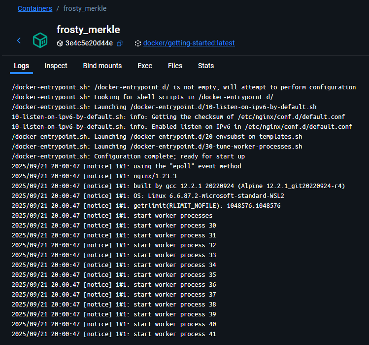
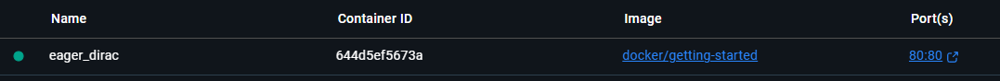
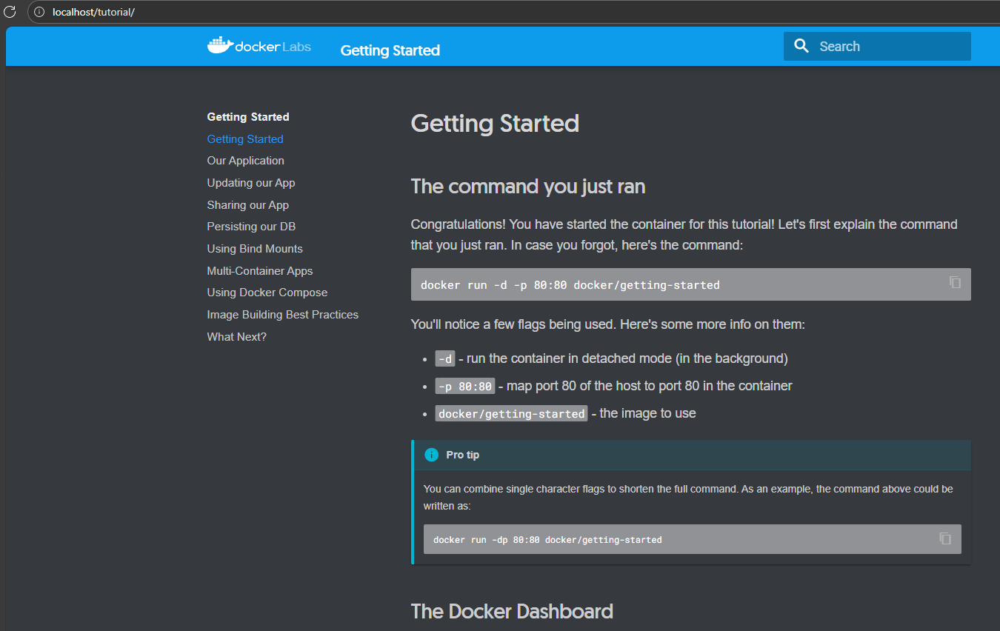

# Comandos de Docker 3

## Permite ejecutar un contenedor de docker:
>   docker container run docker/getting-started

## Permite que es contenedor se mantenga en ejecución:
>   docker container run -d docker/getting-started

## Permite detener el contenedor en ejecucion por ID:
>   docker container stop 3e4c5e20d44e4eb7d53fbfa9c08e16492c795d5a70a47fef1a2c7e44dcc31672
> > Tambien se puede por nombre del contenedor

## Permite asignarle un puerto a un contenedor en especifico
> docker container run -d -p 80:80 docker/getting-started   
> docker container run -dp 80:8080 docker/getting-started   

