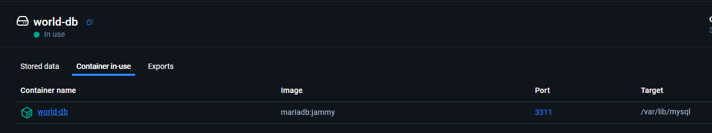
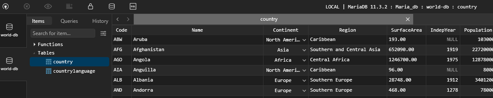

# Volumenes:

## Crean un volumen de datos persistente

> docker volume create world-db
>> Deberia soportar los reinicios de contenedores

## Verificar los volumenes creados:

> docker volume inspect world-db
>>Consola me devolvio:
[
    {
        "CreatedAt": "2025-09-23T02:41:09Z",
        "Driver": "local",
        "Labels": null,
        "Mountpoint": "/var/lib/docker/volumes/world-db/_data",
        "Name": "world-db",
        "Options": null,
        "Scope": "local"
    }
]

## crear un volumen con el contenedor

docker run -d --name world-db -p 3311:3306 -e MARIADB_USER=example-user -e MARIADB_PASSWORD=user-password -e MARIADB_ROOT_PASSWORD=root-secret-password -e MARIADB_DATABASE=world-db -v world-db:/var/lib/mysql mariadb:jammy

>> Consola devolcio:

8004a993bc3168719830b86e462391e223fde602b9aeab8a43643ba2e6604884

## Persistencia de datos en docker:

## Eliminar contenedor y volver a cargarlo:

> docker container rm -f 800

> docker run -d --name world-db -p 3311:3306 -e MARIADB_USER=example-user -e MARIADB_PASSWORD=user-password -e MARIADB_ROOT_PASSWORD=root-secret-password -e MARIADB_DATABASE=world-db -v world-db:/var/lib/mysql mariadb:jammy

ee34687ec1be0558ed5cb3fa6f96f232a7c1dd34e10c6e8791d9bf5c5f5a85d9

>> Persitencia de datos:

